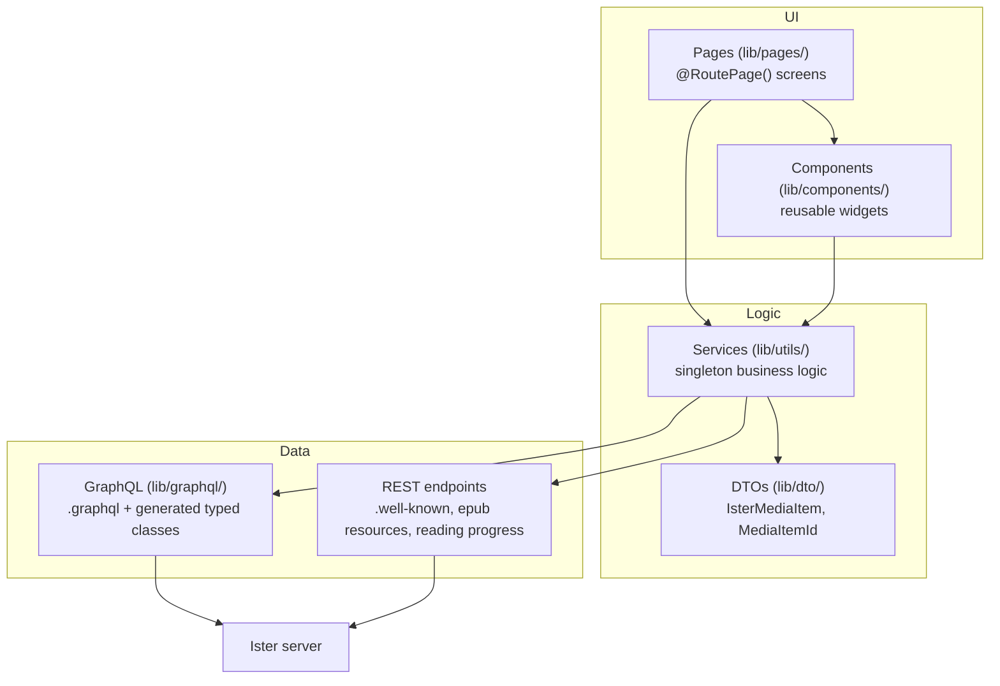

# Layer structure

The four main layers of the player: pages compose components, both call into the service singletons in `lib/utils/`, and the services talk to the server through generated GraphQL types plus a handful of REST endpoints.
