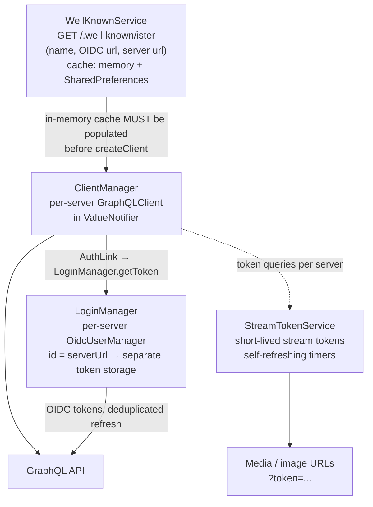

# Multi-server services

Server discovery to authenticated traffic: `WellKnownService` resolves a server name to its URLs, `ClientManager` builds one `GraphQLClient` per server with tokens injected from `LoginManager`, and `StreamTokenService` signs media and image URLs with short-lived tokens.
