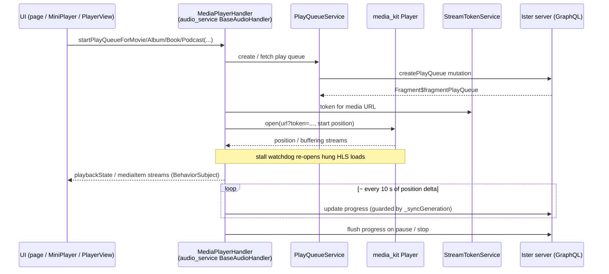

# Playback flow

Playback always runs through `MediaPlayerHandler`: the UI starts a play queue, the handler drives the `media_kit` player with stream-token-signed URLs, and throttled progress sync flows back to the server.
