# Route tree

```mermaid
flowchart TD
    root["/ HomeRoute"]
    player["/player MusicPlayerRoute<br/>(transparent overlay)"]
    remote["/remote/:serverName/:playQueueId RemoteControlRoute<br/>(transparent overlay)"]
    server["/server/:serverName ServerHomeRoute"]

    overview["'' ServerHomeOverviewRoute (initial)"]
    home["home ServerHomeContentRoute"]
    library["library ShowHomeRoute"]
    settings["settings ServerSettingsRoute"]

    setLang["settings/languages"]
    setCluster["settings/cluster"]
    setPlayback["settings/playback"]
    setNow["settings/nowplaying"]
    setAct["settings/activity"]

    show["shows/:showId ShowOverviewRoute"]
    showOv["overview (initial)"]
    episode["episodes/:episodeId ShowEpisodeRoute"]

    search["search SearchRoute"]
    movie["movies/:movieId MovieRoute"]
    album["albums/:albumId AlbumRoute"]
    book["books/:bookId BookRoute"]
    reader["books/:bookId/read/:mediaFileId ReaderRoute"]
    comic["books/:bookId/comic/:mediaFileId ComicReaderRoute"]
    series["series/:seriesId SeriesRoute"]
    podcast["podcasts/:podcastId PodcastRoute"]
    person["persons/:personId PersonRoute"]

    root --- player
    root --- remote
    root --- server
    server --> overview
    overview --> home
    overview --> library
    overview --> settings
    server --> setLang
    server --> setCluster
    server --> setPlayback
    server --> setNow
    server --> setAct
    server --> show
    show --> showOv
    show --> episode
    server --> search
    server --> movie
    server --> album
    server --> book
    server --> reader
    server --> comic
    server --> series
    server --> podcast
    server --> person
```

The `auto_route` tree from `lib/routes/AppRouter.dart`. All server children outside the overview tabs carry `ServerChildDeepLinkGuard`, which pushes `ServerHomeOverviewRoute` under a deep link so back navigation always lands on the server home.
